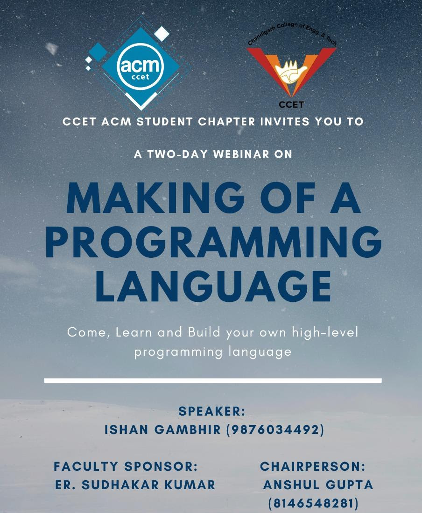
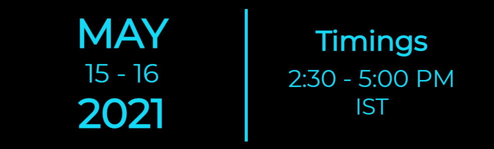

# webinar15052021
  
## Event Description  
###  CCET ACM Student Chapter brings you the opportunity of learning the core development of a Compiler Design, through its Two day Webinar on:  Making of a Programming Language!!!  
In this two-day session, the audience will be guided about how a new high-level programming language is designed, how a compiler translates that code to an assembly language, and then how an assembler translates it to executable machine code. 
  
  

## Prerequisites: 
1)  Have a little bit of knowledge of registers and assembly language is an advantage.  
2) Windows Operating System and Intel Processor (32-bit/64-bit). 
3) Download FASM for windows (https://flatassembler.net/fasmw17327.zip) and set the directory of FASM.exe in the path variable of the system. 
4) Python installed. 
5) It is recommended to make a separate folder for coding, and having training.inc  (An include file for easy implementation, https://drive.google.com/file/d/1fMGacJaJ1kRdGgx436V47BgA9tKA-kTJ/view?usp=sharing) in that directory. 

## Event Outcomes: 
After the event, the audience can code their own compilers, and hence at the end, each one has their own high-level programming language. 

## In case of queries, feel free to contact: 
- Ishan Gambhir (+91-98760 34492) 
- Anshul Gupta (+91-81465 48281) 

